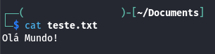
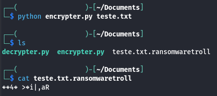
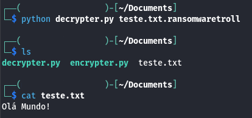

# cybersecurity-challenge-ransomware
Bootcamp CyberSecurity - Desafio Ransomware 

# Requisitos
- Python.
- Biblioteca pyaes.
- Arquivo de teste.

# Arquivo de teste em texto limpo:

# Arquivo de teste criptografado:

# Arquivo de teste descriptografado:
